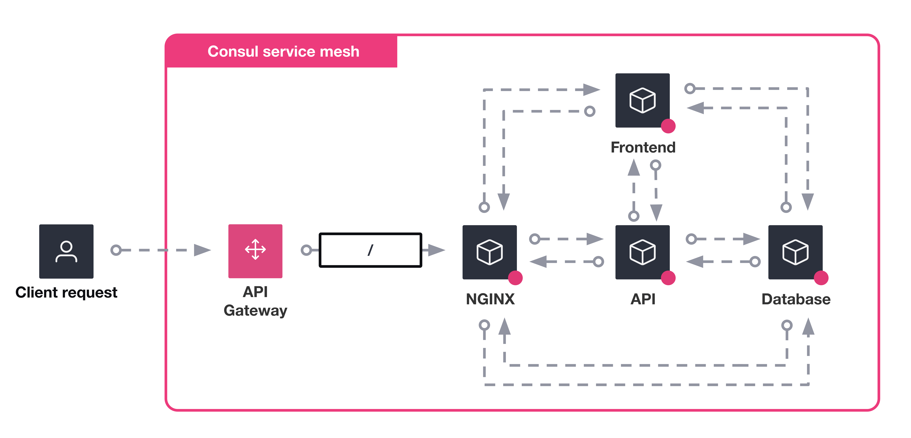
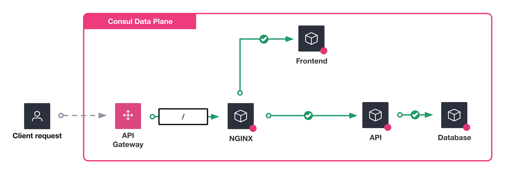

# Learn Consul intentions on VMs

This repository contains companion code for the following tutorials:

- [Control traffic communication between services with intentions](https://developer.hashicorp.com/consul/tutorials/service-mesh-security/secure-services-intentions)
- [Control service requests with application-aware intentions](https://developer.hashicorp.com/consul/tutorials/service-mesh-security/secure-services-intentions-l7)

> **WARNING:** the script is currently under development. Some configurations might not work as expected. **Do not test on production environments.**

The code in this repository is derived from [hashicorp-education/learn-consul-get-started-vms](https://github.com/hashicorp-education/learn-consul-get-started-vms).


## Scenarios

### 00_L4_intentions

Deploys a HashiCups instance in Consul service mesh with *allow all* intention defined.




### Deploy

```
cd self-managed/infrastructure/aws
```

```
terraform apply --auto-approve -var-file=./conf/00_L4_intentions.tfvars
```

### 00_L7_intentions

Deploys a HashiCups instance in Consul service mesh with specific intention defined.



### Deploy

```
cd self-managed/infrastructure/aws
```

```
terraform apply --auto-approve -var-file=./conf/01_L7_intentions.tfvars
```